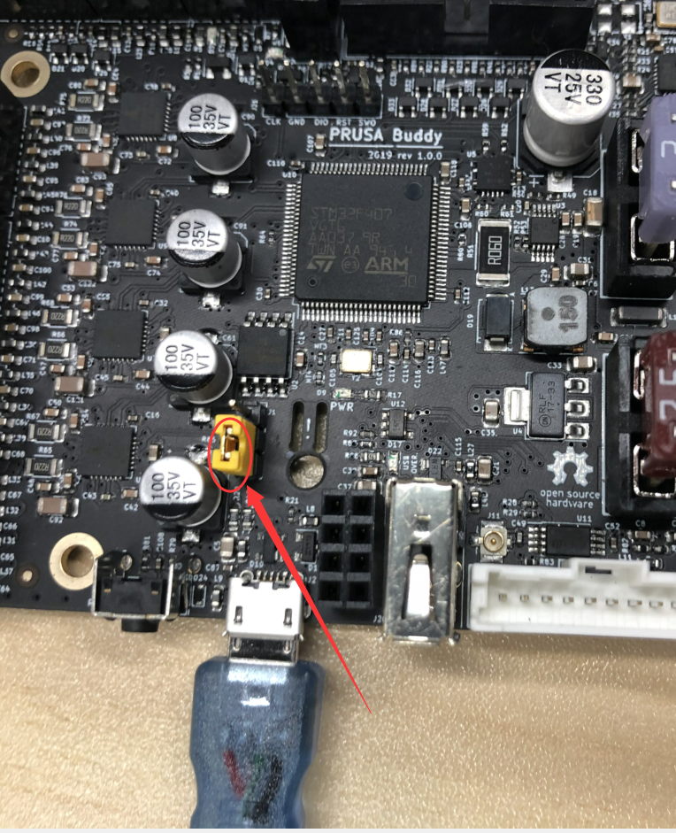
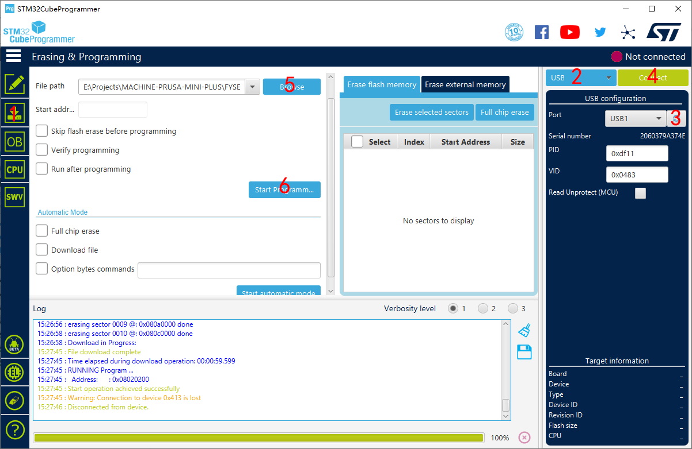

# Firmware

You can use the pre-compiled firmware or custom firmware for  FYSETC Prusa mini clone plus machine.

## Pre-compiled firmware

The ```firmware.hex``` beside this README file is base on PRUSA RELEASE-4.0.5 , you can directly upload this firmware to the board. Follow the [Upload firmware](#jump) instructions.

## Custom firmware

### Generate firmware from latest Prusa firmware

And if you think the firmware is too old , and you want to build your own firmware base on the Prusa latest firmware. Then let me tell you what need to change for FYSETC Prusa mini clone plus machine. 

There is a patch file named ```0001-Patch-for-FYSETC-Prusa-mini-clone-plus.patch```. So if you know ```git diff``` ,then it's easy for you to know the changes. And if not,  below are the changes

In file ```include/marlin/Configuration_A3ides_2209_MINI.h``` following defines are changed.

```
#define Y_BED_SIZE 250
#define Y_MIN_POS -6
```

In file ```src/gui/wizard/firstlay.c``` , change following

```
 const char *V2_gcodes_body[] = {
     "G1 Z4 F1000",
     "G1 X0 Y-2 Z0.2 F3000.0",
     "G1 E6 F2000",
     "G1 X60 E9 F1000.0",
     "G1 X100 E12.5 F1000.0",
```

to
```
 const char *V2_gcodes_body[] = {
     "G1 Z4 F1000",
     "G1 X0 Y0 Z0.2 F3000.0",
     "G1 E6 F2000",
     "G1 X60 E9 F1000.0",
     "G1 X100 E12.5 F1000.0",
```

### Build firmware

After you finish the changes, then please follow Prusa buddy firmware build instructions to build your firmware, it is [here](https://github.com/prusa3d/Prusa-Firmware-Buddy).

## <span id="jump">Upload firmware</span>

If you generate a ```.bbf``` file , you just need to copy the file to USB disk and plug it into machine and then reboot the machine.

If you want to upload ```.hex``` file , following are the instructions.

### Step 1: download STM32CubeProgrammer

You can download it from ST website.

https://www.st.com/zh/development-tools/stm32cubeprog.html

### Step 2: Close the jumper,and connect the board and your computer with USB cable



---

### Step 3: Download 



